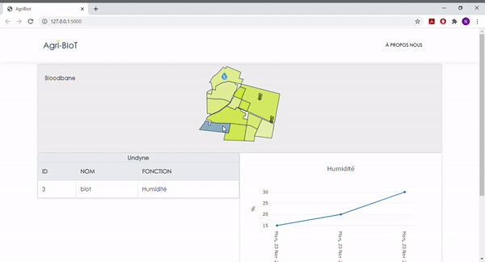

# Agrivision
Notre projet entreprise a pour but d’implémenter une interface web de visualisation de données. Les données sont récupérées directement sur les exploitations agricoles et seront disponibles en local chez le client. Une des valeurs du projet est que le client final (agriculteur) est maître de ses données et il en dispose entièrement. Pour réaliser ce projet, nous allouons une partie conséquente du temps de projet à l’état de l’art et à la recherche de l’existant. En effet, le but n’est pas nécessairement de développer une solution de toute pièce mais plutôt, dans la mesure du possible, d’utiliser une solution déjà existante et de l’adapter au projet d’AgriBIoT.

Pour installer les modules nécessaires :
- Se placer dans le dossier et passer la commande : 
```
pip install -r requirements.txt
```

Pour exécuter le serveur, passer la commande : 
```
flask run
```
Se rendre à l'adresse URL indiquée.

PS: Pour indiquer au terminal l'application avec laquelle travailler en exportant la variable d'environnement FLASK_APP:
```
set FLASK_APP=app.py (app.py dans notre cas seulement)
```
Pour exécuter le serveur en mode développement 
 ```
set FLASK_ENV=development
```


